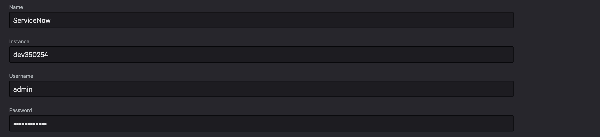

# Foundry Sample with Python Functions

This sample is designed to show how to use Python Functions in Falcon Foundry. It contains a few capabilities:

1. Python functions:

   - **hello**: Simple greeting service
   - **host-details**: Uses FalconPy to get Host details
   - **servicenow**: Uses FalconPy to invoke an API Integration
   - **log-event**: Uses FalconPy to store data in a collection

2. Test workflows to invoke each function.
3. A UI extension on **Endpoint security** > **Endpoint detections** that can be used to call the `hello` function.

## ServiceNow API Configuration

When you install this app, you will be prompted for ServiceNow credentials. You can create a developer account at <https://developer.servicenow.com>. Your configuration should look similar to the following. 

> **TIP**: If you'd rather not create an account, just fill in fake values when installing. You won't be able to test the ServiceNow API integration nor invoke the servicenow function if you use fake values.

## Usage

After installing the app, go to **Fusion SOAR** > **Workflows** to see the Test workflows for functions. Execute the **Test hello function** workflow to ensure it works. The host-details workflow won't succeed unless you change its `host_id` value to match a host in your CID. 

To see the UI extension, go to **Endpoint security** > **Endpoint detections** and click on a detection. Look for the **hello** panel on the right. Click to expand, enter a name, and click the **Say Hello** button.

The source code for this app can be found on GitHub: <https://github.com/CrowdStrike/foundry-sample-functions-python>. 
